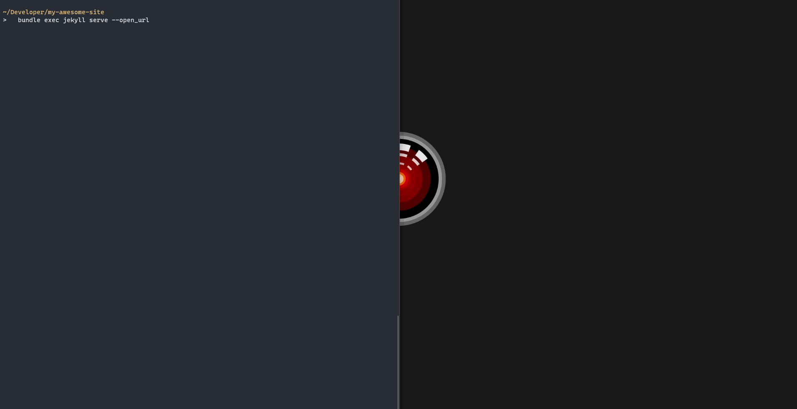
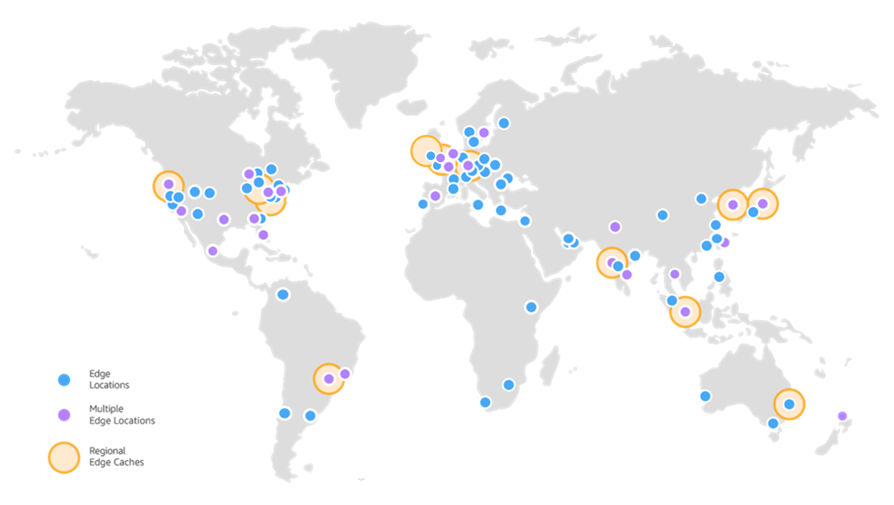
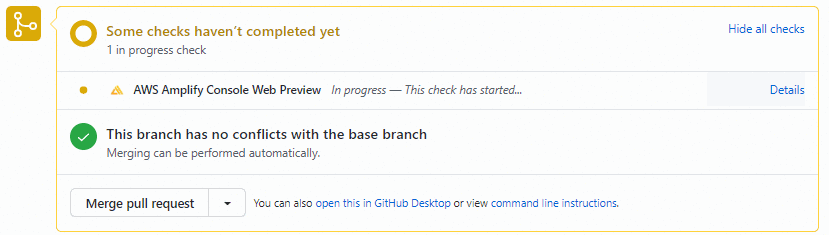
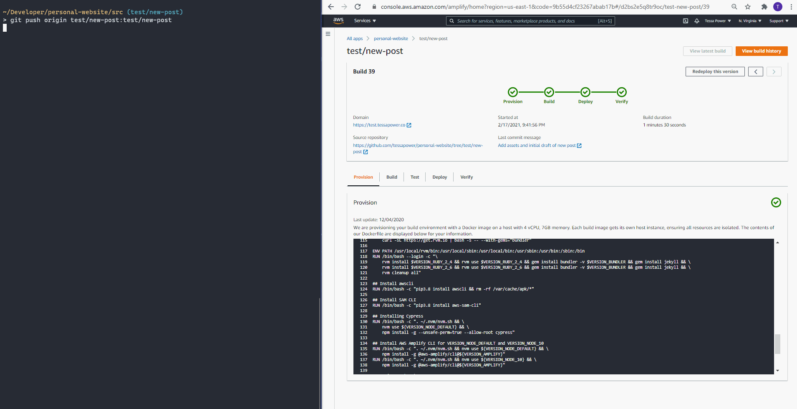

## Personal Website

This is a repo for my personal website, where I post about what I'm learning and working on. It's generated using [Jekyll](https://github.com/jekyll/jekyll),
the [Contrast](https://github.com/niklasbuschmann/contrast) template from Niklas Buschmann, and automatically deployed via [aws Amplify](https://aws.amazon.com/amplify/). It also supports comments on blogposts via [Giscus](https://github.com/giscus/giscus), which you can see in the Discussion section of this repo.

This README serves mostly as a reminder to myself about the structure of the repo and how to deploy when I write new posts.

---

### Jekyll

I chose to use *[Jekyll](https://jekyllrb.com/)*—an open-source, blog-aware static site generator created by Tom Preston-Werner, one of the co-founders of GitHub. Compared to other options, Jekyll ticked a lot of the boxes:

- Setup is super quick;
- Only needs to be built once, so it's fast;
- No moving parts that can break or require maintenance;
- Write content in Markdown, which makes things readable in plain text on GitHub;

The requirements are also pretty lean:

- Ruby
- Bundler (run `gem install bundler` from `src`)
- Repo dependencies are in Gemfile.lock (run `bundle install` from `src`)

### Setup

It only takes a few lines to get set up, and you have a fully functioning static site. This is what the initial bare-bones folder structure looks like:

```
.
├── _posts
│   └── 2020-08-10-welcome-to-jekyll.markdown
├── index.markdown
├── about.markdown
├── 404.html
├── .gitignore
├── _config.yml
├── Gemfile
└── Gemfile.lock
```
`index.markdown`, `about.markdown` and `404.html` are the pages of your site. `_config.yml` contains the settings that affect your whole blog, e.g. title, description, baseurl, and the theme. Blog posts go in the `_posts` folder, and Jekyll automatically generates these on your site according to date. An example post could look like this:

```markdown
---
layout: post
title:  "Lorem Ipsum"
date:   2020-08-10 08:04:17 +1300
tags: [example, jekyll, markdown]
---

# Example Title

This is an example of a **Jekyll** blog post written in *Markdown*.

## H2


### H3

| A table | that has | important info |
```

Within a post you can use [Liquid](https://shopify.github.io/liquid/) tags to access site-wide variables, e.g. `page.path` refers to the path to the raw post or page. As you'd expect, these elements combined make a Jekyll site delightfully readable and simple to maintain! Jekyll also has excellent documentation and plenty of support for migrating content from other popular static site generators.

When you want to start creating content, building the site locally is fast:



Run `bundle exec jekyll serve` once and Jekyll will continue to serve any changes as I make them—making the hardest part thinking of what to write.

---

### [Deploying to AWS with Amplify Console](#deplying-to-aws-with-amplify-console)

To build, host, and deploy my static site, I use the [AWS Amplify Console](https://aws.amazon.com/amplify/hosting/). In a nutshell, Amplify Console provides fully managed hosting for static sites and web apps.

By connecting Amplify Console to a GitHub repo, I can continuously deploy my static site simply by git pushing commits to connected branches. Amplify Console will build the site or app based on the build settings (including running any pre- or post-build commands and tests), and deploy it to Amazon's CDN.

Amplify Console offers some pretty useful features:

- **Branch Auto-detection/-disconnection:** lets Amplify automatically connect to branches that match certain patterns, e.g. `feature/*` or `release*`, and automatically disconnects when branches are deleted.
- **Domain Management:** connect branches to domains or subdomains, e.g. commits to `dev/*` trigger a build and deploy changes to `https://dev.example.app`. You also get a free HTTPS certificate so your site is secure.
- **Access Control:** add a password to certain sub-domains to work on new features or content without making it public.
- **Previews:** see a preview of how your site looks on different devices before merging to the production branch.

There are a bunch more features which I haven't mentioned—these are just the ones I found useful.

When everything is set up, you can see an overview of which branches will be built, any previous builds, and their statuses:


---
#### [Behind Amplify Console](#behind-amplify-console)

Amplify Console leverages **S3** and **Cloudfront** to build, deploy, and serve static sites and SPAs. According to their website, Cloudfront has *"225+ Points of Presence (215+ Edge locations and 12 regional mid-tier caches) in 89 cities across 46 countries."*, which means it really is as close as possible to the requesting client, and has excellent availability (99.99%). Combined with S3, which has [11 9's of durability](https://docs.aws.amazon.com/AmazonS3/latest/userguide/DataDurability.html), it's a pretty solidly supported and well distributed static site.



### [My setup](#my-setup)

For my site, Amplify Console automatically detects branches that match `feature/*` or `test/*` to build and deploy to the subdomains `https://feature.tessapower/co` and `https://test.tessapower.co`.


Previews let me see how my site looks on different devices after building it—I use this as a final checkpoint because merging to `master`.



I use Access Control to prompt anyone who tries to access `https://test.tessapower.co` for credentials, so it's a safe place for me to test changes in the wild.


---
### [My workflow](my-workflow)

Not only is this approach modern and extremely fast, it has made my workflow pretty lean. I can create a new post and deploy my website with just one line of code! Here's what it looks like:


