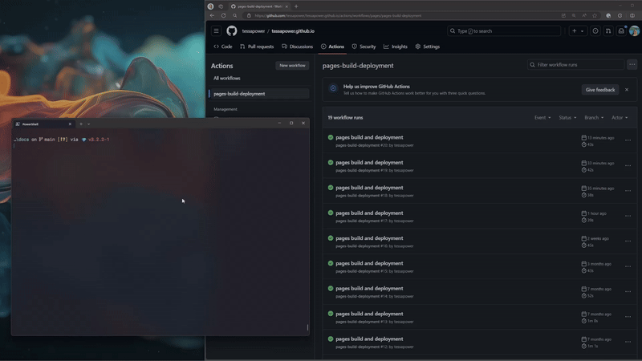

## Personal Website

[](https://github.com/tessapower/tessapower.github.io/actions/workflows/pages/pages-build-deployment)

This is a repo for my personal website, where I post about what I'm learning and working on. It's generated using [Jekyll](https://github.com/jekyll/jekyll),
the [Moonwalk](https://github.com/abhinavs/moonwalk) theme, and automatically deployed via [GitHub Pages](https://pages.github.com/). It also supports comments on blogposts via [Giscus](https://github.com/giscus/giscus), which you can see in the Discussion section of this repo.

This README serves mostly as a reminder to myself about the structure of the repo and how to deploy when I write new posts.

---

### Jekyll

I chose to use *[Jekyll](https://jekyllrb.com/)*—an open-source, blog-aware static site generator created by Tom Preston-Werner, one of the co-founders of GitHub. Compared to other options, Jekyll ticked a lot of the boxes:

- Setup is super quick;
- Only needs to be built once, so it's fast;
- No moving parts that can break or require maintenance;
- Write content in Markdown, which makes things readable in plain text on GitHub;

The requirements are also pretty lean:

- Ruby
- Bundler (run `gem install bundler` from `src`)
- Repo dependencies are in Gemfile.lock (run `bundle install` from `src`)

### Setup

It only takes a few lines to get set up, and you have a fully functioning static
site. This is what the initial bare-bones folder structure looks like:

```
.
├── _posts
│   └── 2020-08-10-welcome-to-jekyll.markdown
├── index.markdown
├── about.markdown
├── 404.html
├── .gitignore
├── _config.yml
├── Gemfile
└── Gemfile.lock
```

`index.markdown`, `about.markdown` and `404.html` are the pages of your site. `_config.yml` contains the settings that affect your whole blog, e.g. title, description, baseurl, and the theme. Blog posts go in the `_posts` folder, and Jekyll automatically generates these on your site according to date. An example post could look like this:

```markdown
---
layout: post
title:  "Lorem Ipsum"
date:   2020-08-10 08:04:17 +1300
tags: [example, jekyll, markdown]
---

# Example Title

This is an example of a **Jekyll** blog post written in *Markdown*.

## H2


### H3

| A table | that has | important info |
```

Within a post you can use [Liquid](https://shopify.github.io/liquid/) tags to access site-wide variables, e.g. `page.path` refers to the path to the raw post or page. As you'd expect, these elements combined make a Jekyll site delightfully readable and simple to maintain! Jekyll also has excellent documentation and plenty of support for migrating content from other popular static site generators.

When you want to start creating content, building the site locally is fast:




Run `bundle exec jekyll serve` once and Jekyll will continue to serve any changes as I make them—making the hardest part thinking of what to write.

---

## GitHub Pages

To set up GitHub pages, I followed the [GitHub Pages docs](https://docs.github.com/en/pages/quickstart).
I created a new repository, pushed my Jekyll site to the repo
(paying attention to the expected directory structure!),
and GitHub automatically built and hosted it for me (for free!) using my custom
domain. Having switched from using AWS Amplify, I found GitHub Pages to be a lot
more intuitive and easier to set up, however I did lose a few features like
previews, custom redirects, and password protected subdomains.

### [Deploying automatically to GitHub Pages](#deploying-automatically-to-github-pages)

Deploying is as simple as merging a working branch into `main` — GitHub
takes care of the rest! This extremely simple setup is a efficient and allows me
to focus on writing content, and less on maintaining the site.

---

### Image Caching

Since GitHub Pages doesn't support custom HTTP cache headers, GIFs and other
images are cached client-side via a Service Worker (`docs/sw.js`) using a
Cache-First strategy. On first visit, images are fetched from the network and
stored in the browser's Cache Storage under the key `images-v1`. Subsequent
visits (and page navigations) serve images directly from cache.

If you replace a GIF or image with a new file of the same name, bump the cache
version in `docs/sw.js` (e.g. `images-v1` → `images-v2`) to force browsers to
fetch the updated file.

---
### [My workflow](my-workflow)

Not only is this approach modern and extremely fast, it has made my workflow pretty lean. I can add
a new post and deploy it to the blog within seconds!


